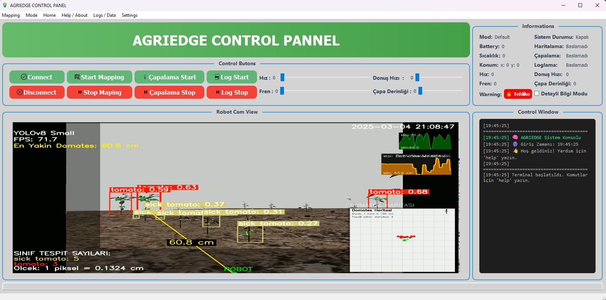
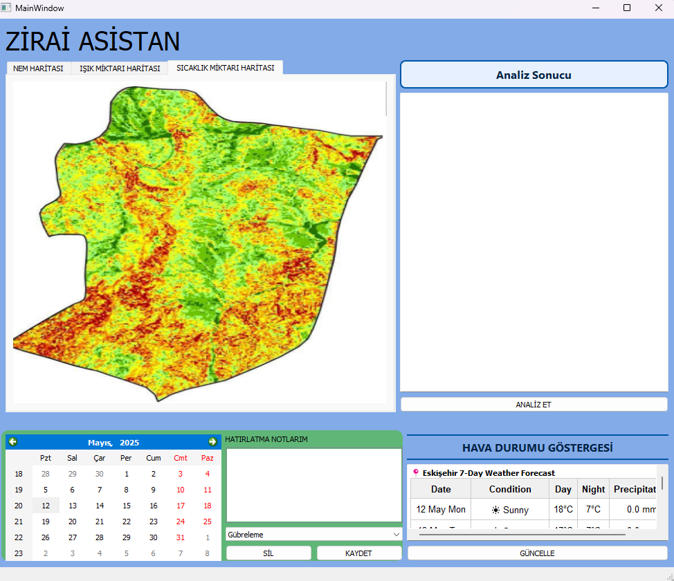

# 🌾 AgriEdge – Akıllı Tarım Robotu Kontrol Paneli

**AgriEdge**, PyQt5 ile geliştirilmiş, otonom ve manuel modda çalışabilen, görüntü tabanlı analiz, çevresel haritalama, sensör takibi ve görev yönetimi sağlayan kapsamlı bir tarım robotu arayüzüdür. Sistem; çiftçiye görsel-işitsel destek sunarak, akıllı karar alma süreçlerini kolaylaştırmayı hedefler.

---

## 🚀 Temel Özellikler

* 🔁 Manuel / Otonom mod değişimi
* 🧠 RGB görüntü üzerinden nem, ışık, sıcaklık analizi
* 📅 Takvim tabanlı hatırlatıcı sistemi
* 🌦️ Eskişehir için 7 günlük hava durumu tahmini (Open-Meteo API)
* 📈 Gerçek zamanlı hız, sıcaklık ve batarya takibi
* 💾 CSV log kaydı ve istatistiksel analiz (Temel/Detaylı)
* 🔌 Çoklu bağlantı türleri: Serial, TCP, Bluetooth, Wi-Fi
* 🗣️ pyttsx3 ile sesli bildirim sistemi
* 💻 Terminal arayüzü ile komut çalıştırma desteği

---

## 🖼️ Arayüz Görünümü





## 🧩 UML Class Diagram

Aşağıdaki UML sınıf diyagramı, AgriEdge sistemindeki temel sınıflar arasındaki ilişkileri ve kalıtım yapılarını göstermektedir. Arayüz (GUI), bağlantı modülleri, sensör yönetimi, analiz bileşenleri ve veri kaydı sınıfları arasındaki soyutlama, kalıtım ve sorumluluk dağılımı bu diyagram üzerinden izlenebilir.


## 📁 Proje Dosya Yapısı ve Açıklamaları

```
AgriEdge/
│
├── MainDriver.py             --> Ana uygulama dosyası. Tüm UI bileşenlerini birleştirir.
│                                Mod geçişleri, terminal, bağlantı, sensör takibi ve komutları burada yönetilir.
│
├── home_page_driver.py       --> Takvim ve analiz ekranı. Kullanıcı tarımsal hatırlatıcılar oluşturabilir,
│                                hava durumu verilerini görebilir, RGB analiz başlatabilir.
│
├── home_page.py              --> Qt Designer ile oluşturulmuş takvim ekranının arayüz sınıfı (UI).
│                                `home_page_driver.py` tarafından kullanılır.
│
├── Manuel.py                 --> Qt Designer'da oluşturulmuş manuel sürüş arayüzünün UI sınıfı.
│                                Butonlar: İleri, Geri, Sol, Sağ, Dur, Mod Değiştir.
│
├── ManuelKod.py              --> Manuel.py'deki butonlara olay bağlama işlemlerini içerir.
│                                Her tuşa basıldığında terminale log düşülür.
│
├── Final.py                  --> Menü çubuğunda LIDAR ve Kinect bağlantılarını simüle eder.
│                                Gelecekte sensör bağlantı menüsü için temel altyapı sağlar.
│
├── robot_parameters.py       --> OOP kullanılarak iki tür robot yapılandırmasını destekler:
│                                - Tekerlekli (WheeledRobotConfig)
│                                - Paletli (TrackedRobotConfig)
│                                Ayrıca bu parametreleri GUI ile düzenlemeye izin verir.
│
├── connection_settings.py    --> Serial, TCP, Bluetooth ve Wi-Fi bağlantılarını simüle eder.
│                                Her bağlantı tipi soyut sınıf `ConnectionInterface`’ten türetilir.
│                                Kullanıcı arayüzü ile bağlantı türü seçilebilir.
│
├── Analizci.py               --> RGB görüntüleri dört bölgeye (Kuzey, Güney, Doğu, Batı) ayırarak
│                                renk yoğunluklarını (Kırmızı, Yeşil, Mavi) analiz eder.
│                                Her bölge için HTML tabanlı yorum üretir ve grafik gösterimi sunar.
│
├── hava_durumu.py            --> Open-Meteo API ile Eskişehir’e ait 7 günlük hava tahminini alır.
│                                Maksimum-minimum sıcaklık, yağış miktarı ve hava durumu ikonlarıyla sunar.
│                                Sonuç QTextBrowser’a HTML formatında yazdırılır.
│
├── data_logger.py            --> Sensör verilerini kaydetmek ve analiz etmek için kullanılır.
│                                - `TelemetryLogger`: Pandas DataFrame ile çalışır.
│                                - `MemoryLogger`: Hafif Python listeleri ile çalışır.
│                                - `BasicAnalysis`: Ortalama, min, max hesaplar.
│                                - `DetailedAnalysis`: Std sapma, batarya değerleri gibi ek metrikleri sağlar.
│
├── style_sheets.py           --> Arayüz için tüm stilleri barındırır. Modüler yapıdadır:
│                                - GREEN_BUTTON_STYLE, RED_BUTTON_STYLE: Başlat/Durdur gibi butonlar
│                                - TERMINAL_STYLE: Terminal metin alanı
│                                - GROUPBOX_STYLE, MAIN_TITLE_STYLE: UI bileşen tasarımları
│                                - CALENDAR_WIDGET_STYLE: Takvim arka planı
│
├── texts.py                  --> Arayüzde kullanılan sabit metinleri içerir:
│                                - VERSION_TEXT: Sistem bilgisi
│                                - USER_MANUAL_TEXT: Kullanıcı kılavuzu
│                                - CONTACT_TEXT: Geliştirici iletişim bilgileri
└── assets/                   --> Kullanılacak ikonlar, haritalar, CSV logları ve görseller burada yer almalıdır.
```

---

## 🧪 RGB Harita Analizi (Analizci.py)

Her analizde görüntü 4 bölgeye ayrılır: **Kuzey**, **Güney**, **Batı**, **Doğu**.
Her bölgedeki R, G, B yoğunluklarına göre öneriler sunulur:

* 🌱 Nem düşük → Kırmızı yoğunluğu → Kuruma riski
* 🌤️ Işık eksik → Mavi düşük → Gölgeleme gerekebilir
* 🔥 Sıcaklık yüksek → Kırmızı artmış olabilir

Sonuçlar HTML tablo + bar grafik olarak kullanıcıya gösterilir.

---

## 💬 Terminal Komutları (MainDriver.py üzerinden)

| Komut        | Açıklama                                  |
| ------------ | ----------------------------------------- |
| `help`       | Tüm kullanılabilir komutları listeler     |
| `status`     | Sistem modu, bağlantı durumu, batarya vb. |
| `map start`  | Haritalamayı başlatır                     |
| `map stop`   | Haritalamayı durdurur                     |
| `set hız 50` | Robot hızını %50 yapar                    |
| `delay 5`    | Komutu 5 saniye gecikmeli uygular         |
| `temizle`    | Terminal ekranını temizler                |
| `version`    | Yazılım, Python, Qt sürümünü gösterir     |

Tüm komutlara sesli geri bildirim de sağlanır (pyttsx3).

---

## 🔌 Desteklenen Bağlantı Tipleri (connection\_settings.py)

* **SerialConnection**: COM port
* **TCPConnection**: IP\:Port üzerinden
* **BluetoothConnection**: Cihaz adı ve kanal numarası
* **WiFiConnection**: Hostname ve port

Tümü soyut `ConnectionInterface` sınıfından türetilmiştir.
GUI ile bağlantı tipi seçilip simüle edilir.

---

## 📊 Telemetri Günlüğü (data\_logger.py)

* Telemetri: Hız, sıcaklık ve batarya verisi her 3 saniyede güncellenir
* Kaydedilen veriler `TelemetryLogger` veya `MemoryLogger` ile saklanır
* İki analiz modu bulunur:

  * `BasicAnalysis`: Ortalama, min, max değerler
  * `DetailedAnalysis`: Standart sapma, batarya minimum-maksimum değerleri
* `export_to_csv()` ile CSV formatına dışa aktarılır
* Sensör geçmişi grafiksel olarak matplotlib ile gösterilir

---

## 🗣️ Sesli Bildirim Sistemi (pyttsx3)

* Uygulama açıldığında karşılama sesi: "Welcome to the Agriedge system..."
* Tüm kritik olaylarda sesli bildirim tetiklenir:

  * Mod değişimi
  * Log başlat/durdur
  * Haritalama başlangıcı
  * Uyarı durumları (terminal loglarında INFO, WARNING, ERROR etiketleriyle)

---

## 📘 Kullanıcı Kılavuzu (texts.py)

Arayüz içerisindeki `Yardım > Kullanıcı Kılavuzu` menüsü altında yer alır.
İçeriğinde:

* Bağlantı işlemleri
* Mod seçimi
* Haritalama, çapalama
* Komut listesi ve örnek kullanımlar
* Uyarı ışığı sisteminin çalışma prensibi

---

## 👨‍💻 Geliştirici Ekibi

**Doğukan Avcı**
📧 [baygutdogukan@gmail.com](mailto:baygutdogukan@gmail.com)
🔗 [GitHub](https://github.com/dogukanbaygut) • [LinkedIn](https://linkedin.com/in/dogukanavci)

**Sinan İlbey**
📧 [snnlby1806@gmail.com](mailto:snnlby1806@gmail.com)
🔗 [GitHub](https://github.com/SinanBey06) • [LinkedIn](https://linkedin.com/in/sn-bey)

---

## 🪪 Lisans

Bu yazılım MIT Lisansı ile lisanslanmıştır. Daha fazla bilgi için `LICENSE` dosyasına bakınız.

© 2025 AgriEdge. Tüm hakları saklıdır.
